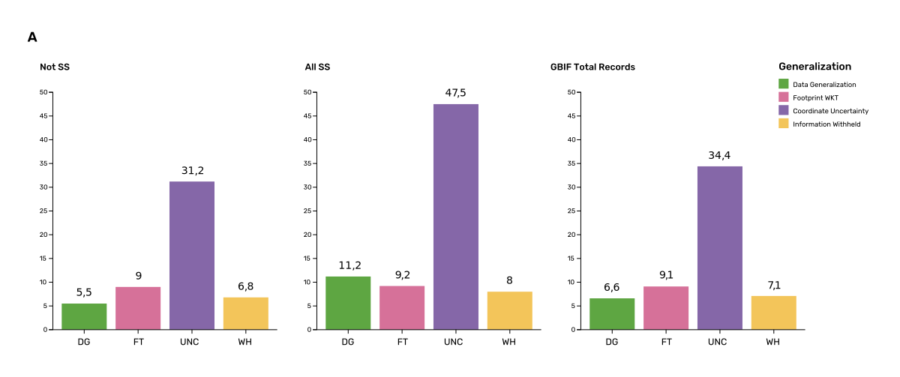

[[gbif-data-management]]
== Sensitive species data management in GBIF

In https://doi.org/10.15468/doc-5jp4-5g10[Chapman (2020)^], generalization refers to any modification performed on source data that conceals sensitive content, which could be related to textual information (name of the area, collector, landowner) or spatial generalizations. For data published through GBIF, the responsibility for generalizing data resides with the publisher. In a survey of data holders by GBIF (https://doi.org/10.35035/vs84-0p13[Chapman 2006^]), two thirds of respondents (65) reported that they generalize data in some way, mostly by deleting or altering localities (42), deleting or decreasing the scale of the georeference (41), or modifying the accuracy (1). All the other generalizations were related to non-spatial elements such as collectors' names, dates and taxonomic information.

One of the most common practices used in the management of sensitive data is to generalize the spatial locality or geographic coordinates (https://doi.org/10.15468/doc-gg7h-s853[Chapman & Wieczorek 2020^]). Spatial generalization typically consists of reducing the precision of the data through generalization to a grid (metric or geographic), or polygon (e.g., circle, administrative boundaries, biogeographic region, watershed). These generalizations carry with them a coordinate uncertainty that is a function of numerous factors, including coordinate precision, GPS accuracy, data source and measurement errors (https://doi.org/10.1371/journal.pone.0215794[Bloom D et al. 2020^]; https://doi.org/10.15468/doc-gg7h-s853[Chapman & Wieczorek 2020^]; https://doi.org/10.1080/13658810412331280211[Wieczorek et al. 2004^]). This coordinate uncertainty defines the geographic limits around the point from where the specimen was most likely collected, usually described in metres or kilometres (https://tdwg.github.io/esp/georeferencing/workflows/NSCF-Georeferencing-protocol.pdf[Bosman et al. 2021^]). In <<table-s2,Appendix C>>, we summarize some of the recommendations of organizations examined in this analysis.

The generalization of georeferenced data should be documented so that users can evaluate the data’s fitness for use (https://doi.org/10.15468/doc-gg7h-s853[Chapman & Wieczorek 2020^]). Omitting this information may considerably reduce the value of the data for analysis, with users often unaware that the data has been modified (https://tdwg.github.io/esp/georeferencing/workflows/NSCF-Georeferencing-protocol.pdf[Bosman et al. 2021^]). For example, higher spatial uncertainties may lead to a lower robustness of species distributional models (https://doi.org/10.1016/j.biocon.2023.110042[Contreras-Díaz R G et al. 2023^]). In order to maintain data quality, reliability and promote reuse, generalization should be documented in a standardized way (https://doi.org/10.15468/doc-gg7h-s853[Chapman & Wieczorek 2020^]). In addition, uncertainties due to the methodology used to obtain the occurrence data, for example, should also be documented independently of any data generalization applied (https://doi.org/10.15468/doc-gg7h-s853[Chapman & Wieczorek 2020^]).

The extent to which data holders and publishers are applying general GBIF and national data generalization protocols is unknown. It is unclear whether those data that are considered sensitive data are being generalized in a standardized manner both within and outside of a country where that species occurs. In this section, we evaluate the degree to which sensitive data is being generalized and the extent to which data generalization protocols are applied across different geographies and organizations. Finally, we provide examples of how data is currently generalized for some well-known sensitive taxa.

[[gbif-generalization-protocols]]
=== Application of data generalization protocols within GBIF

In its broadest sense, generalization introduces uncertainty in the location data of an occurrence. Currently, this uncertainty can be captured mainly through five DwC terms : term:dwc[dataGeneralizations] (DG), term:dwc[informationWithheld] (WH), term:dwc[coordinateUncertaintyInMeters] (UNC), term:dwc[coordinatePrecision] (CP) and term:dwc[footprint] (FT). Of these five terms, https://doi.org/10.15468/doc-gg7h-s853[Chapman & Wieczorek (2020)^] recommended the use of DG and WH for generalizations related to sensitive species data. We took the broader definition and looked at the use of the five terms for taxa listed as potentially sensitive, based on our compiled national and organizational list and the list derived from the IUCN Red List to determine how data generalizations were being applied to these subset of taxa in GBIF.

These two lists of sensitive and potentially sensitive species resulted in 21,098 validated taxa (20,205 species recognized by the https://www.gbif.org/tools/species-lookup[GBIF taxonomic matching tool^]). As a first step, we retrieved occurrence data from GBIF using the following filters: occurrences after 1970, with coordinates and excluding records based on fossil specimens, material sample, and living specimens. We retrieved 386 million occurrence records for taxa on any of the two lists (this included records for 117 genera that were listed on national lists) (https://doi.org/10.15468/dl.gvxuzs[GBIF.org 2023^]).

In a second step aimed at exploring generalization patterns for sensitive and potentially sensitive species, we filtered the list of potentially sensitive species to include only those in threatened (CR,EN,VU) or Near Threatened (NT) categories. We considered that this filter could serve as a potential trigger list for identifying those taxa for which publishers might consider generalizing data. With this filter, we obtained nearly 38 million records for 5,728 species. From the national and organizational lists we obtained 13.9 million occurrences for 258 species, and based on the IUCN-derived list, we obtained nearly 38 million occurrences for 5,710 species. Records were sorted by the generalizations applied, publisher, country of occurrence (country code), and publishing country. Species were categorized as those having either generalized or not generalized occurrences (<<fig-02,Figure 2>>). A species was considered as generalized if one or more of the five DwC terms above had been populated and not generalized if none of the five terms were used.

We found that a remarkable proportion of these occurrences (91.6 per cent) were published by institutions in just nine countries: the United States, Sweden, Netherlands, Belgium, Denmark, Norway, France, Australia and the United Kingdom. When we examined the use of the DG term across countries, there were clear differences. For example, Belgium used DG for over 90 per cent of the occurrences for sensitive species followed by the Netherlands (81 per cent) and Switzerland (69 per cent). Nearly 90 per cent of occurrences from Belgium made use of WH, and 91 per cent of the records related to sensitive species from Finland used FT.

 

[[fig-02]]
.Generalization of records according to their potential sensitivity and conservation category. Bars represent the proportions of occurrence records that had used the Darwin Core terms Data Generalization (DG), Footprint WKT (FT), Coordinate Uncertainty (UNC) and Information Withheld (WH). On the left of panel A are all sensitive and potentially sensitive species identified by organizations and IUCN (All SS); in the centre are records of all species excluding sensitive species (Not SS), and on the right are overall records found in GBIF. Panel B only includes only records of Threatened and Near Threatened sensitive and potentially sensitive species.

The UNC term was the most commonly used term for species on both lists and across GBIF, but tended to be more extensively used in occurrences of threatened and Near Threatened species on the national and organizational lists (58 per cent of the occurrences). For all species identified as sensitive (both lists, all IUCN categories, for 21,098 validated taxa), UNC was used for 47.5 per cent of the records, higher than when compared with the 34 per cent of records using UNC for all GBIF records (<<fig-02,Figure 2>>, panel A). However, the term UNC may signal spatial uncertainties of short distances that fail to act as efficient generalizations in terms of obfuscating species localities. In fact, when exploring the generalizations of the records related to threatened and near threatened sensitive species, nearly half of the occurrences that made use of UNC term had uncertainties of less than 500 metres, which do not comply with most of the recommended buffer distances provided in guidelines (see https://doi.org/10.15468/doc-5jp4-5g10[Chapman 2020^]). The term CP was seldomly used, and FT was used to the same extent as for non-sensitive occurrence data in global GBIF dataset (nearly 10 per cent of the occurrences).

Besides UNC, the majority of records (82.9 per cent) for Threatened and Near Threatened sensitive and potentially sensitive species provided no information for the recommended terms relating to generalizations, e.g. WH and DG (<<fig-02,Figure 2>>, `panel B`), and, therefore, we assume that data is being provided in its original form with no generalization as recommended for sensitive data (https://doi.org/10.35035/vs84-0p13[Chapman 2006^]). For records of species in any conservation category, nearly 90 per cent of their occurrence records do not make use of either WH or DG (<<fig-02,Figure 2>>, `panel A`).

There was little difference between sensitive species (regardless of their IUCN category) and those that were not sensitive in their use of the WH term (8 per cent and 6.8 per cent respectively, <<fig-02,Figure 2>>, panel A) and between all records in GBIF and threatened and near threatened sensitive species records (7.1 per cent and 9.2 per cent). However, threatened and near threatened species identified by institutional and organizations tended to have a higher proportion of records with any of the generalization terms.

We identified only 362 species where all their occurrences had been generalized using WH and/or DG. These species with all occurrences generalized tend to have a lower average number of occurrences published (7.6), compared with the average number of occurrences for a sensitive species (6,776) or with those species in which none of their records were generalized (neither WH nor DG, 110 occurrences per species, 2,288 species). What we see is that data generalizations are exceptions, and most records of known or potentially sensitive species are not generalized.

In organizational lists the sensitivity is generally defined for a specific taxon within a specific administrative boundary, usually at regional or national scales. Therefore, we examined those occurrence records of species on the combined national and organizational list located in the country where they are considered sensitive. We found that nearly 2.8 million occurrences (20.1 per cent) of the 13.9 million records from globally threatened species on national and organizational lists are located in the country or region where they were identified as sensitive. We also found that, for occurrences of species in countries in which they are considered as sensitive, 13 per cent used the WH term and 10 per cent the DG term (<<fig-03,Figure 3>>), compared with the 11 and 15 per cent of occurrences in all countries (<<fig-02,Figure 2>>).

Most of these occurrences were published by organizations located within the same country as the occurrences, with only 3 per cent (nearly 770 thousand) of the occurrence records identified as repatriated (i.e. coming from data publishers not within the country where the occurrence was recorded). These repatriated records were more likely to be generalized when compared with non-repatriated records, with 55 per cent of the repatriated records using WH (compared with 8 per cent of non-repatriated records) and 47 per cent using DG (compared with 8 per cent of non repatriated, <<fig-03,Figure 3>>). These different levels of generalization between repatriated and non-repatriated records could be caused to higher levels of sensitivity when publishing data across international borders, or a need for strengthening capacity for generalizing data at national levels. In addition, some countries may be using terms other than WH and DG to generalize occurrences, as in Finland, where FT is widely used in records.

image::img/web/ss-guide-graphs-07.svg

[[fig-03]]
.Records of species identified as sensitive by institutions and organizations, only including those located in the regions in which they are considered sensitive. Among the near 13.9 mill records related to species listed as sensitive by institutions and organizations, nearly 20 per cent are located in the specific regions in which they were identified as sensitive (2,8 mill). Most of them are published by publishers of the same country in which they are defined as sensitive (2.7 mill). Repatriated records of sensitive species occurring in the areas in which they are considered sensitive tend to present a remarkable higher trend to be generalized

However, the resolution of this analysis at a national level may not have picked up more fine-scale temporal and geographical parameters defined within national sensitive species lists that could lead to our under- or over-estimation of generalization at a national scale. For example, _Egernia stokesii_ is considered sensitive only in Western Australia and would only need to be generalized within its administration boundaries. Our analysis looked at records for _Egernia stokesii_ across all of Australia with no fine-scale regional filtering. Another example is the Finnish Biodiversity Information Facility (FinBIF) sensitive species list that specifies not only smaller administrative boundaries, but also specific seasons in which the occurrence of a species is considered sensitive data, with generalizations only applied during that particular period.

The WH and DG terms can encompass a range of uses beyond than providing spatial uncertainty or data restriction. We explored the information provided for the WH and DG terms by taking a randomly generated subset of occurrences of our listed species in which these terms were used, resulting in 271,157 occurrences from taxa on both our national and organization list and the IUCN-derived list. We manually explored the text provided with the DG and WH columns and categorized them according to content, separating those that mentioned if the record was sensitive from those that did not.

From the 271,157 occurrences, 187,007 had used the term WH, of which only 3.3 per cent referred explicitly to data sensitivity. In these records, the publishers mentioned that data was generalized (withheld) to protect a species under conservation threat (PlantNet, France) or referred to a sensitive species list (Department of Biology, Lund University) (see examples of WH text in <<table-s3,Appendix D>>). In the case of Lund University, the WH field was used for all species in the dataset to highlight that occurrences of three other species were not published because the species are considered sensitive. This example raises the question of the role of metadata versus occurrence-level data for highlighting sensitivities within the data. None of the occurrences where WH had been used to identify sensitivity also provided information for the terms DG, FT, CP or UNC, meanign that the publishers used the WH term exclusively to inform sensitivity. Among the remaining occurrences with WH that did not refer to sensitivity, 57.3 per cent detailed the grid reference system used (e.g. ‘OSGB Grid Reference SO3574’), while for 44.9 per cent of the occurrences the publisher offered additional data under request, such as morphometric measurements, necropsy findings etc. A few records specified that the geographical locations were blurred “as required by the publisher” without indicating the reasons. Finally, among the records with WH not mentioning sensitivity, we found 12.7 per cent (22,992) in which sensitivity was informed using the DG term. Therefore, publishers make use of DG to record sensitivity while also using WH for delivering additional information about the restrictions.

From the 271,157 occurrences, 107,046 occurrences used the DG term and, in contrast to WH with a few occurrences mentioning sensitivity (3.3 per cent), 70.5 per cent indicated data sensitivity. Most of the 40 publishers identified using the DG term in relation to sensitivity gave the same information and text relating to the type and extent of the generalization (in kilometres) and the justification for the generalization (see examples of DG text in <<table-s2,Appendix C>>). In fact, 35 publishers explicitly mentioned the sensitivity of the species, and five mentioned that the data was generalized due to the conservation category of the species. Some publishers also detailed the specific location in which the species were considered sensitive, e.g. specific areas of the country in which data is generalized. This was the case for 24 publishers from the United Kingdom and 12 from Australia. The remaining records used the DG term for providing information on spatial data and temporal issues.

In records with WH and DG refering to data sensitivity, we found several cases in which specific national or local organizations were mentioned as references ([[Appendix C: Table S2]]), which coincide with the institutions from which we obtained the sensitive species list (<<table-01,Table 1>>), or institutions related to them (e.g., Natural England, Natural Resources Wales, Scottish Natural Heritage, SINP, eBird Australia). Therefore, structured local initiatives may be used by several publishers to identify sensitive species and also to determine the generalizations to be used, probably generating more safe records but also preventing overgeneralizations.

[[generalization-examples]]
=== Examples of sensitive species generalizations

[[generalization-examples-rhinos]]
==== Rhinoceroses

Species from the family Rhinocertidae are well-known targets for poachers and hunters, so we used them as an example to explore the use of data generalizations on their GBIF-mediated occurrence records. We filtered GBIF occurrences for the family, keeping only records with coordinates and excluding observations based on fossils, living specimens and material samples. The resulting data included records for six species (excluding extinct ones) (<<table-s3,Appendix D>>). Among those species (all with accepted species-rank scientific names), there were also five subspecies with accepted scientific names and two were included as synonyms. In total, the six living species presented 3,371 occurrences, from which we excluded 187 located in countries outside their natural distributions (the United States, the Russian Federation, Netherlands and France) that were considered specimens from ex situ collections.

For the remaining 3,184 occurrences, 88.2 per cent were generalized using the WH term, most of them (2,265) using the WH term included explicit indications of sensitivity in the data, e.g. “coordinate uncertainty increased to _x_ metres to protect the threatened taxon”. Only 273 occurrences made use of the DG term (9.4 per cent), but none of them referred to the sensitivity of the species, mentioning only the spatial generalizations (e.g., “record obtained as a central point of a grid with 15 minutes”, “randomly obfuscated between 5-25 km”). In 342 occurrences with no WH nor DG, the record applied UNC, ranging from 1 (12 records) to 12,000 mt (13 records), although most applied 250 metres of uncertainty (220 records). Overall, there were 82 records with no generalization applied (not using any of the selected terms: WH, DG, FT, DP, UNC) for occurrences of _Diceros bicornis_, _Ceratotherium simum_ and _Rhinoceros unicornis._

[[generalization-examples-orchids]]
==== Orchids

Orchids are one of the largest families of flowering plants with https://powo.science.kew.org/taxon/urn:lsid:ipni.org:names:30000046-2[more than 31,000 species globally^] and commonly traded and are particularly vulnerable to over-harvest because many species have a limited range and/or occur at low densities (https://doi.org/10.1111/cobi.12721[Hinsley et al. 2016^]; https://doi.org/10.1093/botlinnean/box083[Hinsley et al. 2018^]; https://doi.org/10.1186/s40529-018-0232-z[Fay 2018^]). All species are on CITES Appendix II.

We retrieved 16,647 occurrences of threatened orchid (CR, EN, or VU) species in GBIF using similar filters to those for rhinos (https://doi.org/10.15468/dl.yyw5pj[GBIF.org 2022a^]). The records corresponded to 250 accepted species and seven synonyms for accepted names. Of these occurrences, 3,678 (22 per cent) had used the term WH and 7,731 (46 per cent) had used the term DG. In contrast with rhinoceros records, the mention of sensitivity was found for 96.1 per cent of the records with DG and in 60.7 per cent of the WH. All the records that used the WH to signal sensitivity were published by iNaturalist, stating “coordinate uncertainty increased to _x_ metres to protect threatened taxon.” The Swiss National Biodiversity Data and Information Centres (InfoFlora) published the largest number of occurrences (7,352), using DG and the text “in order to respect the currently nationally agreed ethical framework while simultaneously sharing scientifically utilizable data for large scale studies''. Other terms were identified to inform sensitive data generalizations, such as term:dwc[occurrenceremarks] (23 records) and term:dwc[georeferenceRemarks] (2,114 records). In total, 5,250 (32 per cent) occurrences of threatened orchids were not generalized.

[[fig-04]]
.Rhinos and orchid generalizations in GBIF-mediated data. It can be observed that generalizations are different between the two taxa groups. In orchids, generalizations are mainly informed and generalized based on DG; meanwhile, in rhinos, the most frequent generalization is by WH data. 
image::media/image5.png[image,width=511,height=224]
image::media/image3.png[image,width=81,height=31]
image::media/image2.jpg[image,width=46,height=46]

[[data-management-conclusions]]
=== Data management conclusions

This analysis provides a first effort at assessing the degree to which sensitive and potentially sensitive data is managed across GBIF and this initial assessment, and it shows a mixed landscape. Firstly, most occurrences that we identified as sensitive or potentially sensitive were not generalized even when they were on national lists using WH and DG terms. While this percentage was higher for well-recognized species such as rhinos and orchids, even here significant numbers of records were not adequately generalized. However, a far larger number of occurrences did include coordinate uncertainty values, although these may be under adequate thresholds for effective generalization of data. Secondly, when data is generalized, different publishers applied different generalization protocols, and their practices may be affected by the country in which they're located, as more occurrences from some countries are generalized than from others. Between publishers, there is a wide variety in the use of Darwin Core terms for identifying sensitivity at the occurrence level, with no fixed vocabulary for the terms and a wide range of different types of information within the fields. The use of occurrence-level indications of sensitivity should be considered at the same time as improved sensitivity metadata. Finally, when we have national sensitive species lists, data coming from publishers outside of the country are more generalized than those from within the country, minimizing the perceived threat of repatriated data with respect to sensitive species data.
