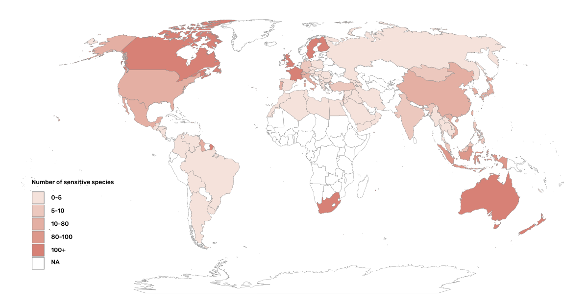

= Supplementary materials

[[table-s1]]
[appendix]
== Conceptual framework for defining sensitive species

.Conceptual framework of the main elements that have been used to define sensitive species, based on Chapman´s data generalization guidelines, complemented with additional elements found in the literature. The table includes examples of the approach developed by some organizations and initiatives. The specific elements proposed by Chapman to define sensitivity are in *_bold italics_* and include both biological and non-biological aspects. This compilation represents a contribution to facilitate the development of protocols to manage sensitive species data, particularly for data generators, aggregators and repositories.
[width="100%",cols="25%,75%",options="header",]
|===
|Elements |Description of the elements used to identify sensitive data

2+|A. *Sensitive species*: identification of sensitive species

|_Risk of harm_ 
|- Risk of harm is a result of the *_use_* of the targeted species, e.g. if the species is *hunted, killed, disturbed, exploited, collected (individuals, seed, eggs), harvested, poached, traded*. Also related to the *interest* that the species invokes in humans (e.g., birdwatching) or a *perceived threat to humans* out of fear (e.g., spiders), or danger (e.g., bats, snakes) or as pests (e.g., badgers). +
- Harm to the species is always *intentional* and not accidental or ascollateral damage of an activity in which the species is not targeted. +
- Risk of harm can be from both legal *and illegal activities*. +
- Risk of harm may be considered for species with *phylogenetic proximity* to a currently targeted species. +
- Risk of harm is higher for those species of *higher economic,cultural* or *medicinal value* +
- Risk of harm is higher for *rare, uncommon* and/or *endemic*, as these may invoke specific interest +
 +
_Examples in use_: GBIF; NBN (UK), ALA (Australia), NSSL (South Africa), INPH-SINP (France), ERIN (Australia), IUCN, SLU (Sweden), Laji.Fi (Finland), eBird

|_Evaluating the impact of harm_
|- *Intensity of the activity*: Does the activity have lethal ornon-lethal effects on individuals? Are all individuals targeted and at all times of the year i.e. does the activity occur all year or only at specific times? Are there specific life stages (e.g., eggs, mature adults, juveniles) or sexes that are targeted that may affect the demographics of the populations? Is the activity increasing or decreasing? +
- *Ecology of the species*: To what extent will the species be able torecover/regenerate from targeted use or disturbance? Does the targeted population have a very restricted range that makes it more vulnerable to harmful activities? +
- *Novelty of the species*: Descriptions of new species can triggertrade and overexploitation of those
species. +
 +
_Examples in use_: GBIF, eBird, NSSL, ERIN, IUCN, SINP, DRYAD

|_Conservation status_
|- Species is *Critically Endangered*, *Endangered* or *Vulnerable* at a global, regional, national, or subnational level. +
 +
_Examples in use_: GBIF (criteria 4.2), ALA, NSSL, iNaturalist, IUCN, SLU, DRYAD

2+|B. *Sensitive data*: will the publication of the data increase potential harm to the taxon.

2+|B.1 _Species features_

|_Ability to detect and track the species_ (*detectability*)
|- *Mobility*: Species with low mobility (e.g., cactus, molluscs, sedentary species) may be more detectable if specific location data is informed. +
- *Abundance and density*: species found at low densities i.e. dispersed individuals over a wide area may be less likely to be found. Gregarious species with higher densities may be easier to detect when compared with solitary species. +
- *Accessibility*: some locations may be very remote or dangerous to reach, limiting access. +
- *Territoriality*: species with predictable displacements orphilopatry may make individuals easier to locate.

|_Time and location-specific factors_ 
|- Does the data provide information of *nesting/breeding sites* of the species? +
- Does the data provide evidence of a species during known periods when targeted exploitation is higher e.g. when in bloom , or when on targeted life stages e.g. eggs or seeds that may be harvested?

2+|B.2 _Data content and local context_

|Public availability of the data
|- *Novelty*: Is the data is already publicly available in scientific literature, news, social media, atlases, popular knowledge, legal or illegal sources, or findable using an internet search engine? If it's a novel location for the species, it may be considered more sensitive. +
- *spatial resolution*: higher levels of resolution / precision at which the data is published may increase risks +
 +
_Examples in use_: ERIN, SINP

|_Protection of the area_
|- Consider the *effective protection* of the area in which the record is located. +
 +
_Examples in use_: DRYAD, ERIN, https://doi.org/10.35035/vs84-0p13[Chapman 2006^].

|_Local legislation and conservation_ 
|- Consider the existence of *species-level legislation* that may locally protect the species against exploitation +
- Will *conservation efforts* be impacted or benefit from the data publication. +
- Consider any *local data publication protocols, guidelines or legislation* related to the publication of data related to the species.

|_Potential conflicts_ 
|- Consider land tenure, i.e if the record is located on *privately or community-managed lands* +
- Check legal and social norms related to *permissions to publish* data on that area

|===

[appendix]
== Nationally sensitive species map

.Number of species identified as sensitive obtained from the organizational lists. Countries with dash patterns and those with lists reviewed by the present report. The names of the countries are included only for those with sensitive species.

[[table-s2]]
[appendix]
== Use of Darwin Core terms

.Examples of the texts used in the records reviewed in which the Darwin Core terms term:dwc[dataGeneralization] (DG) or term:dwc[dataWithheld] (WH) were used to describe data management due to the potential sensitivity of the species.
[width="100%",cols="9%,23%,29%,12%,12%,8%,7%",options="header",]
|===
|DWCA Term |Text |Comment |Publisher/institution |Species |IUCN Red List Category |Country of the occurrence |DG |Geographic information generalized during aggregation due to the sensitivity of the data to diffusion, according to SINP communication rules |Many records are published following the same text-forma. Text given in French and English |UMS PatriNat (OFB-CNRS- MNHN) |Tetrax tetrax |NT |France

|DG |Location in England is already generalized to 0.01 degrees. Sensitive in ENGLAND, Name: England, Zone: COUNTRY [Sensitive, Natural England] |Many records are published following the same text-format, and modifying the location, extent of generalization, area in which the taxon is sensitive, and the reference (in this case Natural England) |Biological Records Centre |Lutra lutra |NT |England

|DG |Record is Australia in Endangered. Generalized to 10km by Birds Australia. |Many records are published following the same text-format, and modifying the conservation category, extent of generalization and the reference (in this case, Birds Australia) |NSW Bird Atlassers |Dasyornis brachypterus |EN |Australia

|DG |Represents an endangered/threatened species. The specific locality has been removed to protect this species from over-collection. These data may be supplied to researchers on request | |Landcare Research |Pittosporum patulum |EN |New Zealand

|WH |Coordinate uncertainty increased to 29330m to protect threatened taxon |Many records are published following the same text-format, and modifying the extent of generalization |iNaturalist* |Spiranthes brevilabris |EN |USA

|WH |Geographic information generalized during aggregation at the request of the producer |Many records are given with the similar text. Text given in French and English |UMS PatriNat (OFB- CNRS-MNHN) |Neophron percnopterus |EN |France

|WH |Coordinate uncertainty increased to 30003m to protect threatened taxon |Many records are published following the same text-format, and modifying the extent of generalization |iNaturalist* |Ceratotherium simum |NT |South Africa

|WH |Coordinate uncertainty increased to 30699m to protect threatened taxon |Many records are published following the same text-format, and modifying the extent of generalization |iNaturalist* |Ceratotherium simum |NT |Zimbabue
|===

*As observed, iNaturalist used both WH and DG to describe sensitivity.

[[table-s3]]
[appendix]
== Rhinoceros data

.Table S3. Total occurrence data found in GBIF for extant species of the family Rhinocertidae according to the conservation status and to what extent information was provided on data generalizations (DG and WH) for those species. Text information provided with the terms is provided in parentheses. Note that Diceros bicornis presents two conservation categories, explained by the two recognized subspecies with different categories.
[width="100%",cols="24%,15%,12%,16%,19%,14%",options="header",]
|===
|Species |IUCN Red List category |No. of occurrences |No. generalized as DG |No. generalized as WH |Not generalized
|Northern white rhinoceros
+_Ceratotherium cottoni_ 
|CR
|4
|0
|4 (to protect taxon)
|0

|Sumatran rhinoceros +
_Dicerorhinus sumatrensis_
|CE
|1 
|0 
|1 (to protect taxon)
|0

|Black rhino +
_Diceros bicornis_
|CR
|906
|273 (no mention sensitivity)
|495 (to protect taxon)
|137 (15.1%)

|(Javan rhinoceros) +
_Rhinoceros sondaicus_
|CR 
|1 
|0
|1 (to protect taxon)
|0

|Indian rhinoceros +
_Rhinoceros unicornis_ 
|VU 
|351 
|25 (to maintain geoprivacy) 
|315 (to protect taxon, requested by observer)
|36
(10.3%)

|__(__White rhino) _Ceratotherium simum_ 
|NT 
|1,762
|0
|1,594
|168 (9.5%)

|_Diceros bicornis bicornis_ 
|NT 
|158 
|0 
|158 (to protect taxon)
|0

|*Total*
|
>|*3,183*
>|*288*
>|*2,569*
>|*341 (10.7%)*
|===

*Only considering DG and WH
